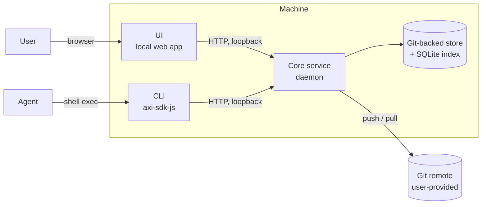

# DocManager AXI: architecture and build plan (v1)

Working name: `docmanager-axi`. Distributed as an npm package, same model as reactive-axi and lavish-axi. Everything runs on the user's machine, bound to loopback only.

## 1. Problem and scope

Markdown workflows have shifted to HTML. Users accumulate many HTML documents that are really the same document at different points in time, with no system tracking which file supersedes which, where the current version lives, or how the document evolved. Existing AXIs edit documents; none of them manage the resulting sprawl.

**v1 goals**

- Let the user or an agent tell the system which documents to track.
- Let the user or an agent declare that one document is a newer version of another, building version lineage per document family.
- Diff and store those versions the way git stores commits, but purpose-built for HTML files.
- Present tracked documents and their version history in a visual UI.
- Let the user snapshot the entire workspace to a git remote and pull it back down on another machine (Mac, Windows, or Linux), with no dependency on that machine's file layout.
- Ship as a single npm package the user's agent can install and run locally.

**Explicit non-goals for v1**

- Semantic search or RAG over document content. This is phase 2, once the storage and metadata model exists to build embeddings on top of. A cheap, non-semantic keyword search (section 3.5) closes the practical "where's the document about X" gap in the meantime without waiting on embeddings - it is not a step toward RAG, just a much simpler tool solving the same everyday need.
- Automatic detection of version relationships from content similarity. v1 relies on the user or agent declaring relationships explicitly; the system may suggest a link using cheap heuristics (matching titles, near-identical structure) but never links documents on its own.
- Editing documents. That is Lavish AXI's job.
- Multi-user or hosted deployment. Single user, single machine at a time, sync happens through a git remote the user already controls.

## 2. System architecture

Three components, one source of truth.



- **Core service.** A long-running local daemon that owns all state: the content-addressed document store, the version metadata, and settings. It is the only process that writes to storage. It exposes a loopback HTTP API and serves the UI's static assets.
- **UI.** A local web app that talks directly to the core's API. Structured actions (settings, tracking a folder, browsing version history) go straight to the core; nothing waits on an agent turn to complete.
- **CLI.** The interface the agent shells out to, built on `axi-sdk-js`. Command handlers are thin HTTP clients to the core. The agent is the layer for judgment calls, natural-language instructions, and orchestration, not the layer that persists state.

The core is the single source of truth. The UI and the CLI are both clients of it, which is what lets a settings change made in the UI show up immediately to the agent, and a version link made by the agent show up immediately in the UI, without either one blocking on the other.

## 3. Core service

### 3.1 Process lifecycle

The core is not started manually. The first CLI command or UI launch that needs it starts it as a detached background process and leaves it running until it is stopped, one of three ways: explicitly with `docmanager core stop`, from the UI's own stop action, or automatically after a long period of no activity (several hours by default, configurable). That idle timeout exists specifically because docmanager's actual usage pattern is short CLI commands and occasional UI visits, not a continuous session someone stays engaged with the way a review tool's UI does - a background process a user genuinely forgot about is a real, likely outcome here, not a hypothetical. An open, connected UI tab counts as real activity on its own (see the SSE heartbeat below) and keeps resetting the timer, so the idle timeout never fires during genuine use, only on actual abandonment.

Discovery and singleton enforcement work through a lock file, acquired with an exclusive create so two processes starting at the same instant cannot both win:

1. Try to create `~/.docmanager/core.lock` exclusively. If it already exists, read the PID and port it holds.
2. Confirm the existing entry is actually this tool's core, not just that the PID is alive: hit its `/health` endpoint and check a service identifier in the response. Liveness alone is not enough, since PIDs are reused after a reboot and an unrelated process can already hold the recorded port.
3. If that check fails, treat the lock as stale, delete it, and spawn fresh.
4. On spawn, bind to `127.0.0.1` on a fixed default port (`4389`, continuing lavish-axi's `4387` and reactive-axi's `4388`), not a randomly chosen one - a stable port is what lets an already-open browser tab keep working across a restart, instead of needing to be reopened every time. A port a daemon just vacated can briefly still answer as in use while the OS finishes releasing it, so a `stop` immediately followed by a `start` retries the fixed port a few times before giving up, rather than treating a transient window as a genuine conflict. Only falls back to a random port if it's still taken after those retries, write the fresh PID and port to the lock file, and proceed.

TCP loopback is used instead of a Unix domain socket so the same code path works unmodified on Windows, which has inconsistent Unix socket support. Detached-spawn semantics differ enough between Mac, Windows, and Ubuntu that phase 1 tests core startup and shutdown on all three explicitly, rather than assuming Node abstracts the difference away.

The core writes its own logs to `~/.docmanager/core.log`, since it runs detached from any terminal and a crash would otherwise be invisible. `~/.docmanager` is created with user-only permissions, since it holds document content.

`core.log` is capped at 5MB (`src/core/log-rotation.js`, overridable via `DOCMANAGER_MAX_LOG_SIZE_BYTES`), checked once at every daemon spawn (`lifecycle.js`) and periodically from inside an already-running daemon (every 30 minutes by default, `daemon.js`) - a single daemon can stay running far longer than the interval between restarts, since continuous activity keeps resetting the idle timeout. Rotation is copy-then-truncate, not rename-then-recreate: the daemon's own stdout/stderr are redirected to this file's file descriptor for its entire lifetime, and Node has no way to reopen `process.stdout` to a different file at runtime, so renaming the file out from under an already-open fd would silently orphan all future log output into the renamed file forever. Truncating the file in place (same inode, same fd, same name) is what actually works whether rotation runs once at spawn or repeatedly from inside a live process - verified directly, not just reasoned about, by writing through a real open fd, rotating the file out from under it, writing through the same fd again, and confirming the new content lands in the file still named `core.log`. One prior rotation is kept (`core.log.old`), not a numbered series - enough for a "what happened right before this" look without becoming its own maintenance burden.

The lock file is how a running core is discovered, but nothing forces it to stay accurate: something outside the tool's own control (deleting `~/.docmanager`, restoring from a backup) can remove or replace it while the process it describes keeps running, orphaning that process invisibly. The core checks periodically that its own lock file still identifies it and shuts itself down if not, rather than leaving a permanently leaked process behind. Stopping the core is also prompt regardless of what's still connected to it: a held-open connection (the UI's `/events` stream in particular, which is deliberately never-ending) does not block shutdown from completing.

Liveness and identity aren't the only things worth confirming about an existing core - **an `npm install -g`/`npm update` can put a newer version's files on disk while an already-running core keeps executing the old code it loaded at startup**, since Node has no way to notice a change made to files out from under a running process. `GET /health` already returns the running core's own `version` (`src/version.js`, embedded at build time); step 2 above compares it against the CLI's own freshly-imported `VERSION` on every single invocation - free, since the health check already happens there regardless. A mismatch means an upgrade happened since this core last started: `ensureCoreRunning()` sends it `SIGTERM`, waits (briefly, bounded) for it to actually exit, then spawns its replacement on the same lock/port machinery already described above - completely transparent to whichever command triggered it, the same as any other cold start. `docmanager core status` is read-only and never restarts anything on its own, but still surfaces the mismatch plainly (`stale: true`, both versions) rather than just reporting "running" with no further detail, so a user who checks status explicitly isn't left guessing whether they're about to hit a self-heal on their next real command.

### 3.2 Storage

Two things are stored, and they are kept deliberately separate because they have different consistency needs.

**Content and metadata (synced, git-backed).** A local git repository at `~/.docmanager/store` holds:

- Document content, addressed by content hash. The hash is the canonical identity of a version; the original filename is metadata, never the storage key. This sidesteps Windows path-length limits, reserved characters, and case-insensitivity, none of which apply to a hash-named file.
- One JSON file per document family, describing its versions, the supersedes relationships between them, its free-form tags (`family.tags`, a plain string array - `POST /families/:id/tags`, section 3.3), and the synthetic logical path the user or agent assigned to it (for example `/reports/quarterly/q3`), which can be changed later without losing history (`POST /families/:id/rename`).
- A `.gitattributes` file that disables line-ending normalization for stored content, so a checkout on Windows cannot silently change a file's hash relative to the same checkout on Mac or Linux.

v1 tracks the HTML document itself. Assets it references, such as images or stylesheets, are not tracked as part of the document. This keeps the content model simple, one file in and one hash out, and can be revisited if it turns out to matter in practice.

A content hash identifies a version uniquely within its family. If identical content ends up tracked under two different synthetic paths, each still gets its own family; the store deduplicates the underlying blob but never merges families on the strength of matching content alone, since identical content is not the same thing as the same document.

This repository is what gets pushed and pulled during a snapshot. Because the metadata is plain JSON, one file per family, normal git merges resolve cleanly when two machines change different families before syncing. A conflict on the same family surfaces as a real git conflict; `docmanager snapshot pull` reports it to the user rather than trying to auto-resolve, while `docmanager sync` (section 6.2) auto-resolves the two most common shapes of this and falls back to the same report-and-abort behavior for anything less mechanical.

The core serializes every write to the store, including git operations, through a single-writer queue inside the core process. A local write, a push, and a pull never run against the working tree at the same time, since interleaved git operations on one working tree corrupt it.

On first run, if `~/.docmanager/store` does not exist, the core initializes it as a fresh git repository. If the user's first action on a new machine is a snapshot pull rather than any local tracking, pull clones the configured remote into that path instead of assuming a repo is already there.

The store shells out to the system `git` binary rather than bundling a pure-JS implementation, since real remotes, real credentials, and real merge behavior matter more here than a fully self-contained install. The core checks for `git` on first use and, if it is missing, returns a structured error pointing at the setup instructions in the project README rather than a raw dependency error. Those instructions are written so an agent can act on them directly, but installing anything on the user's machine is never done autonomously: an agent following them stops and asks for the user's approval before running an install command, the same as any other action that changes the user's system.

**Local index (derived, not synced).** A SQLite database at `~/.docmanager/index.db`, rebuilt from the JSON metadata whenever the store changes (on startup, after a pull, after a local write). It exists purely for fast queries from the UI and CLI. It is never committed to the store and never part of a snapshot, because SQLite files do not merge and have no reason to cross machines when they can be rebuilt from the synced JSON in milliseconds. The rebuild writes to a temporary file and swaps it into place, so a query running mid-rebuild never sees a half-written database.

**Local machine state (never synced).** A small file at `~/.docmanager/local-state.json` maps each synthetic logical path to wherever its source file currently lives on this specific machine, if the user has pointed the tool at a live folder. Each real path maps to at most one synthetic path on a given machine; tracking a path that is already mapped elsewhere is an error, not a silent overwrite. This mapping is what keeps the system independent of any one machine's file layout: the synthetic path travels in the snapshot, the real path never does. Pulling a snapshot onto a new machine gives you the full document history immediately; relinking a synthetic path to a live folder on that machine is a separate, explicit step.

**Document organization (synced, git-backed).** Alongside `families/`, the store holds a `folders/` directory, one JSON file per folder (`{id, name, parentId, createdAt}`), for organizing tracked documents into a navigable, nested hierarchy independent of `syntheticPath` - a folder can exist empty and be renamed without touching any document it contains. A family record gains one new optional field, `folderId` (`null` = unfiled/root); a document belongs to at most one folder at a time. Both are purely additive to the existing schema, so a family JSON written by any pre-folders version of docmanager is read correctly with `folderId` defaulting to `null` - no migration. Deleting a folder is refused unless it is already empty (no child folders, no families pointing at it); reparenting a folder rejects a cycle.

v1 does not watch tracked folders for changes. The index reflects reality as of the last explicit `track`, `link`, or `status` call. Passive file-watching is a natural phase 2 addition, not a v1 requirement.

Detection is triggered rather than passive, but once triggered, capturing a new version at an already-tracked path is automatic, not a suggestion. This is a different case from the heuristic-suggestion flow in section 9, which is about guessing whether some newly noticed, previously untracked file might secretly belong to an existing family: that is genuinely ambiguous and stays suggestion-only. It does not apply here, because there is no inference involved: the synthetic path is already known to belong to a specific family, so if the content hash at that path no longer matches its last recorded version, the only explanation is that the document changed, and the core records it as the family's newest version without asking. Reconciliation runs as a side effect of any read that reports tracked state, `GET /families`, `GET /families/:id`, and `docmanager status` in particular, so the previous and new versions both show up, linked, the next time the CLI is asked or the UI is opened. There is no separate reconcile command in v1; folding the check into the existing read paths means the UI shows current state just by being opened, with no extra step for the user to remember.

### 3.3 API surface

Indicative, not exhaustive:

| Method | Path | Purpose |
|---|---|---|
| `GET` | `/families` | List document families with current version summary |
| `GET` | `/families/:id` | Full version history for one family |
| `POST` | `/documents/track` | Start tracking a file or folder |
| `POST` | `/documents/untrack` | Stop tracking one or more documents, without touching the real file on disk |
| `POST` | `/documents/:id/link` | Declare a supersedes relationship |
| `GET` / `PUT` | `/settings` | Read or write settings, including the snapshot git remote |
| `POST` | `/snapshot/push` | Commit pending changes and push the store to the configured remote |
| `POST` | `/snapshot/pull` | Pull the remote, rebuild the local index |
| `GET` | `/events` | Server-sent events, so the UI updates live when the CLI or agent changes state |
| `GET` | `/content/:hash` | Raw content of one version, for the UI's read-only reading pane |
| `GET` | `/content/:hash/diff-against/:otherHash` | The given version's content, block-level-highlighted against another version (`?mode=removed\|added`), section 3.4 |
| `POST` | `/core/stop` | Gracefully stops the core, from the UI's own stop action |
| `GET` | `/doctor` | Diagnostic health check: git, store, index, and content integrity - auto-repairs what's provably safe to, reports the rest |
| `GET` | `/families/:id/diff` | Line diff between two versions (`?a=<hash>&b=<hash>`), computed on normalized content |
| `POST` | `/families/:id/revert` | Moves `headVersion` back to an existing version - never creates or deletes a version, never touches the real file on disk |
| `POST` | `/families/:id/rename` | Changes a family's synthetic path in place; keeps the same id and full version history. Also updates this machine's own `local-state.json` mapping so it doesn't go stale |
| `POST` | `/families/:id/tags` | Whole-array replace of a family's tags |
| `GET` | `/folders` | List every folder, flat - the caller builds the parent/child tree from `parentId` |
| `POST` | `/folders` | Create a folder (`{name, parentId}`) |
| `POST` | `/folders/:id/rename` | Rename a folder in place |
| `POST` | `/folders/:id/move` | Reparent a folder under a different parent (or root); rejects a cycle |
| `DELETE` | `/folders/:id` | Delete a folder; refuses unless it is already empty |
| `POST` | `/families/:id/move` | Move one document into a folder, or `null` to unfile it |
| `POST` | `/documents/move` | Batch move (`{ids, folderId}`); one bad id never aborts the rest |
| `GET` | `/search` | Keyword search over tracked documents' paths, titles, and body text (`?q=<query>`), section 3.5 |
| `GET` | `/ssh-check` | Read-only SSH auth diagnostic for the configured remote - never writes to `~/.ssh`, section 6.1 |
| `DELETE` | `/families/:id/versions/:hash` | Permanently removes one version's record, healing the supersedes chain - never the whole family, never the content blob |

Binding to loopback keeps the API off the network, but it does not stop other software already running on the same machine from reaching it, including a malicious page open in the same browser: browsers do not block a page from calling `http://127.0.0.1`, which is the same mechanism behind DNS-rebinding and drive-by-localhost attacks. The core checks the `Origin` header on every request and rejects any request whose Origin does not match the UI's own origin. Requests with no Origin header at all, which is how the CLI's own HTTP client calls in, are accepted, since only browser requests carry one.

### 3.4 HTML diffing

Two HTML exports of the same content can differ byte-for-byte on whitespace or attribute order alone. Before treating two versions as different, the core normalizes: consistent attribute ordering, collapsed insignificant whitespace, stable serialization. The diff shown to the user is computed on the normalized form, not the raw bytes.

Implemented as `src/core/diff.js`'s `diffVersions()`, reusing `html-normalize.js`'s existing `normalizeHtml()` exactly as-is (the same normalization that already decides whether two versions differ at all, so nothing about that decision's own risk profile changes). A second, purely display-only function, `prettyForDiff()`, inserts a newline before every tag so the normalized output becomes line-shaped enough for a real line diff - `normalizeHtml()`'s own output drops whitespace-only text nodes entirely, which is correct for an equality check but unreadable as a diff. The actual line comparison uses `diffLines()` from the `diff` package (a real, deliberate dependency, not a default reflex - a hand-rolled diff algorithm has real edge cases, and this project already added `parse5`/`better-sqlite3` specifically when correctness mattered more than staying dependency-free). The API returns the structured diff parts, not pre-formatted text, so the CLI and UI each render their own presentation from one shared computation.

**A source-line diff is precise but asks the reader to think in markup, not prose.** For reading a document rather than auditing its source, `diff.js`'s `renderHighlightedContent()` produces a second, complementary view: each version rendered as an actual page, with the blocks that differ visually highlighted (GitHub's own diff colors - a light tint plus a solid left border, red for what the "from" side removed, green for what the "to" side added), so a reader sees the change the way they'd read the document itself, not its tags. No strikethrough on a removed block - useful for a single code line, but it makes a whole removed prose paragraph noticeably harder to read, which defeats the point of a *reading* view.

Background tint alone isn't a reliable readability guarantee here, since this is injected into an arbitrary tracked document whose own CSS is completely unknown - it could set its own text color, a dark background, anything. The injected rule forces both background AND text color together as one matched, deliberately-chosen-for-contrast pair (and extends the same forced color to every descendant of a marked block, since inheritance alone loses to any more specific rule the tracked document set on a nested link or span), with a `prefers-color-scheme: dark` variant so it stays readable against a dark-themed tracked document too. This is one of the few places in the whole project that reaches for `!important` - a deliberate, reasoned exception (documented as such in `diff.js`) rather than the specificity-fight habit this project's own stylesheet otherwise avoids: overlaying a diagnostic marker on arbitrary, unpredictable third-party CSS (including a possible inline `style` attribute) is exactly the situation `!important` exists for.

Deliberately block-level, not word-level. The unit of comparison is a "leaf content block" - a `<p>`, `<li>`, heading, table cell, or similar tag that doesn't itself contain another block tag (falling back to `<body>`'s direct element children for a document that uses none of the recognized tags, e.g. an all-`<div>` structure). Each document's ordered sequence of block contents is diffed with `diffArrays()` (the same `diff` package, its array-sequence mode rather than line mode) - a block either matches one in the other version (left unmarked) or it doesn't (tagged `data-diff="removed"`/`"added"` and nothing else). This is a deliberate ceiling on precision in exchange for a real safety property: marking a `data-diff` attribute onto an element that already exists in the tree can never produce broken markup, unlike a word-level approach that splices new `<ins>`/`<del>` boundaries into arbitrary text runs and risks crossing element boundaries incorrectly. A paragraph with one changed word highlights as a whole paragraph, not word-by-word - a real, honest trade-off, not an oversight.

Served as raw HTML, not JSON, at `GET /content/:hash/diff-against/:otherHash?mode=removed|added` - the same reasoning as `/content/:hash` itself: the UI's two side-by-side panels are sandboxed iframes (`sandbox="allow-scripts"`, no `allow-same-origin`, section 5), so the highlighting has to live inside the served document itself as an injected `<style>` block; the parent page has no way to reach into either iframe to style it from the outside, by design. `mode` only changes which CSS (and therefore which color) applies to that hash's own exclusive blocks - the underlying block-matching logic is identical either direction.

The Rendered view opens in a dedicated full-screen modal, not inline in the family view - the timeline and reading pane are already enough on one screen, and a side-by-side comparison needs real vertical space to be usable, not a cramped strip fighting the rest of the page for room. The same sandbox boundary that keeps the highlighting server-injected also means the parent page cannot read or set either iframe's scroll position directly to keep them in sync while the reader scrolls - `postMessage` is the one channel that still works across an opaque-origin sandbox, so each served comparison document carries a small injected script (alongside the highlighting `<style>`) that reports its own scroll position as a ratio on every scroll event and applies an incoming ratio the same way; the parent page's only job is relaying one pane's ratio to the other, identifying the sender via `event.source` (a valid, comparable reference even across the sandbox, unlike anything else about that window) rather than trusting the message's claimed origin. A `syncing` guard on the receiving side stops a programmatic scroll from re-triggering its own outbound message and looping.

### 3.5 Search

A cheap, non-semantic keyword search over currently-tracked documents - deliberately not the phase-2 RAG/semantic search from section 1's non-goals, which stays deferred until embeddings are worth the added complexity. Backed by a SQLite FTS5 virtual table (`src/core/index.js`), populated during the same `rebuildIndex()` every other change already triggers, so it never needs its own separate maintenance path. Indexes four signals per family, HEAD version only (searching every historical draft would surface stale content, not current state): the synthetic path, the document's own extracted title (its `<title>`, falling back to its first `<h1>` - `html-normalize.js`'s `extractTitle()`, shared with the duplicate-suggestion heuristic in section 9 so there's exactly one implementation), its visible body text with `<head>`/`<script>`/`<style>` excluded (`extractPlainText()`), and its tags (space-joined into the same indexed column - a query isn't scoped to one signal, so a search term matches whichever of these it actually appears in). A missing content blob or a family whose record fails to parse never breaks search for every other family - the same defensive pattern applied throughout `index.js`, `suggest.js`, and `reconcile.js` after a real bug surfaced it (see `techContext.md`'s thirteenth-round findings).

Query terms are individually quoted and prefix-matched before being handed to FTS5 (`"term"*`, joined by FTS5's default implicit AND), both for forgiving substring-style matching and to keep arbitrary user input safe against FTS5's own query-syntax characters. Results are ranked by FTS5's built-in `bm25()` relevance score and include a highlighted snippet (`snippet()`) - the server marks matches with a plain `**term**` convention rather than HTML, so the CLI can show it as-is and the UI can turn it into `<mark>` tags, one shared computation rendered two ways.

**Revert is not "a new version with old content."** Versions are keyed by content hash, and hash is deterministic - reverting to old content can never produce a new, distinct hash, only re-point at the existing one. `revertToVersion()` in `store.js` moves `family.headVersion` back to an already-known hash; nothing is added, nothing is removed, and the real file at the tracked live path is never touched. This is the direct equivalent of moving a git branch pointer to an earlier commit without deleting anything newer - the fuller history stays completely visible (the UI's timeline already renders every version in chronological order regardless of the supersedes chain, so this needed no UI redesign). If the live file on disk still holds newer content after a revert, the next reconcile correctly reports it `behind-head` - the exact mechanism built for the cross-machine-pull case in section 6 - with zero special-casing for revert specifically.

**Deleting a single version is a genuinely different, more consequential operation than revert - it permanently discards a version's own record, not just moves a pointer.** `deleteVersion()` in `store.js` removes one entry from `family.versions`, but never leaves a dangling `supersedes` pointer to a hash that no longer exists: whichever version superseded the deleted one gets re-linked to the deleted version's own parent, healing the chain exactly the way `git rebase --onto`/dropping a commit would. Deleting the current head moves `headVersion` back to that same parent - the same mechanics as an implicit revert, combined with actually discarding the record. The underlying content blob is left untouched, the identical reasoning `deleteFamily()` already applies (content-addressed, possibly shared with other versions or families, so deleting it here isn't safe in general). Refuses outright on a family's only remaining version (`CANNOT_DELETE_LAST_VERSION`) - that operation already exists and means something different: `untrack`, removing the whole document. Also refuses (`VERSION_STILL_LIVE`) if any live, locally-mapped file still holds the exact content being deleted (compared on normalized HTML, the same comparison `reconcile()` itself uses) - deleting it in that state would be self-defeating, not safe: `reconcile()` has no way to tell "genuinely new content" from "content whose version record was just removed," so the very next reconcile would silently re-capture the exact bytes just deleted as a brand-new version. Found as a real bug in practice, not a hypothetical - a version created at the end of a Lavish editing session came right back after being deleted, since the session's working copy stayed live-mapped with that same content. Refusing up front, with the real file path in the error message, replaced an earlier design that let the deletion through and treated the resurrection as a safety feature ("re-captured, not silently lost") - correct in the narrow sense that no data was lost, but confusing in practice, since the user's actual intent (permanently remove this version) was silently undone.

## 4. CLI

Built on `axi-sdk-js`'s `runAxiCli`, which supplies command-first dispatch, TOON output, structured errors, the `--version` fast path, a free `update` command, and `installSessionStartHooks()`. No part of it is extended or forked. Docmanager-axi depends on it for the CLI shell only; the core service, storage, and UI are docmanager's own code, sitting behind that shell.

Representative commands:

- `docmanager track <path>... [--as <syntheticPath>] [--relink]` — start tracking one or more files and/or folders in one call. A folder is expanded recursively for `.html` files, with each discovered file's synthetic path derived from its location relative to that folder's root, not just its filename, so two same-named files in different subfolders never collide. Vendor and build directories (`node_modules`, `.git`, `dist`, `build`, `.next`, and similar) are skipped during the walk, so pointing `track` at a folder that happens to contain other people's projects only ever picks up the documents that actually belong to the user. `--as` only applies when tracking exactly one file. One target failing (a missing path, a naming collision) never aborts the rest of the batch — every target gets its own result. `--relink` works the same way in bulk: relinking a whole previously-pulled folder in one command is the intended way to reconnect an entire snapshot's worth of documents to a new machine, not a one-file-at-a-time chore.
- `docmanager untrack <id>...` — stop tracking one or more documents. Removes the family and its version history from docmanager; never touches the real file on disk. The counterpart to a mistaken or no-longer-wanted `track` call.
- `docmanager families` / `docmanager families view <id>` — list families, view one family's version graph as TOON
- `docmanager families diff <id> <hashA> <hashB>` — show what changed between two versions, computed on normalized content (section 3.4)
- `docmanager families revert <id> <hash>` — make an older version current again; changes docmanager's own history only, never the real file on disk (section 3.4)
- `docmanager families delete-version <id> <hash>` — permanently remove one version's record, healing the supersedes chain; refuses on a family's only remaining version (use `untrack` for that instead), and refuses if a live locally-mapped file still holds that exact content (edit or untrack it first - otherwise the next reconcile would just re-capture it)
- `docmanager families rename <id> <newSyntheticPath>` — change a tracked document's synthetic path in place; same id, same full version history, and this machine's own local-state mapping is kept in sync so `status`/`families` never report a stale path afterward
- `docmanager families tags <id> [--set "a,b"] [--add <tag>] [--remove <tag>]` — view or change a family's tags; no flags shows the current set. `--set` replaces the whole array; `--add`/`--remove` are computed CLI-side against the family's current tags, then sent as a full replace, the same whole-array-replace API `--set` uses
- `docmanager families move <id>... --to-folder <folderId>` / `--unfile` — move one or more tracked documents into a folder, or back out to unfiled/root; batch-capable like `track`/`untrack`, one bad id never aborts the rest
- `docmanager folders create <name> [--parent <id>]` / `docmanager folders list` / `docmanager folders rename <id> <newName>` / `docmanager folders move <id> [--parent <id>]` / `docmanager folders delete <id>` — create, list (as an indented tree), rename, reparent, and delete folders; delete refuses unless the folder is already empty
- `docmanager families export <id> <hash> --to <path>` — write one version's raw content to a real file, reusing the existing `GET /content/:hash` route (no new server route needed)
- `docmanager families lavish <id> <hash>` — export a version to a docmanager-owned working file and open it in Lavish Editor in one step, using docmanager's own bundled `lavish-axi` dependency directly (never `npx`, never a global install - section 5's own "Editing a version with Lavish Editor" has the full detail)
- `docmanager link <fromId> <toId>` — declare that one document supersedes another
- `docmanager status` — home view: tracked families, anything the heuristic layer flagged as a possible version match, snapshot sync state
- `docmanager search <query>` — keyword search over tracked documents' paths, titles, and body text (section 3.5), not semantic search
- `docmanager settings get|set` — read or write settings from the CLI, same settings the UI edits. `set` accepts `--snapshot-remote` and/or `--snapshot-remote-token` independently (section 6.1); `get` never returns the token itself, only whether one is set
- `docmanager snapshot push|pull` — trigger a sync
- `docmanager sync [--dry-run] [--no-auto-link]` — pull, additionally auto-resolving the two common divergence shapes instead of always stopping at a raw git conflict (section 6.2); preferred over plain `snapshot pull` whenever more than one machine may be involved
- `docmanager ui` — ensure the core is running and open the UI in the default browser
- `docmanager setup hooks` — install session-start hooks via `installSessionStartHooks()`, so a new agent session opens with tracked families and pending suggestions already in context
- `docmanager setup ssh` — read-only SSH auth diagnostic for the configured remote (section 6.1); never generates a key or writes to `~/.ssh`
- `docmanager doctor` — checks git availability, store/git validity, family record and content-blob integrity, and local-state mapping consistency. Auto-repairs what's provably safe to (rebuilding the SQLite index, which is explicitly derived/disposable data; removing a local-state mapping whose family has genuinely and verifiably ceased to exist). Never touches anything that could represent real document data loss - a corrupt family record or a missing content blob is only ever reported, the same approval-gating principle as the reset/uninstall action, since deciding what to do about a real corruption is the user's call, not something to guess at automatically.
- `docmanager reset --confirm` — the supported, safe alternative to a user manually running `rm -rf ~/.docmanager` (a real thing that happened once in this project's own history, with no better tool available at the time). Stops the core first if one is running and waits for it to actually exit (`lifecycle.js`'s `waitForProcessExit()`, reused from the stale-core-restart feature) before deleting - an open file handle can make deletion fail outright on at least one real platform this project targets, not just race harmlessly. Refuses outright without `--confirm`, throwing a `VALIDATION_ERROR` describing exactly what would be deleted, rather than a softer default - irreversible and total, the same class of action as installing `git` or generating an SSH key (section 3.2), and subject to the identical hard rule: an agent must never invoke this on its own initiative, only after the user's own explicit, in-the-moment approval, every time.
- `docmanager gc` — runs `git gc` against the local store (`src/core/maintenance.js`). Every version of every tracked document is a git commit forever (the append-only model this whole project is built on); nothing else ever compacts that history as it grows across many families over real long-term use. Unlike `reset`, this is non-destructive (it repacks git's own internal objects, never touches document data - a `familyIntegrity`/`contentIntegrity` check via `docmanager doctor` before and after confirms nothing changes about what's tracked) and needs no approval-gating, but it's still deliberately opt-in rather than automatic - a maintenance command the user or their agent runs occasionally, not background work triggered on every push/pull. Reports the store's `.git` directory size before and after so the effect is visible, not just asserted.

Every command handler resolves a client to the core (starting it if needed) through `resolveContext`, then makes one or two HTTP calls and returns a plain object for `runAxiCli` to render as TOON.

If a request to the core fails because the daemon is not running or unreachable, the CLI starts it once and retries the request before surfacing anything to the agent. It never retries more than once, so a genuinely broken core still fails loudly with a structured error instead of hanging.

### Teaching an agent to use it

Session-start hooks are the primary path, but they only help in a harness that supports them, and they cost tokens on every session whether docmanager is relevant or not. An installable Agent Skill (`skills/docmanager/SKILL.md`) is the secondary, complementary path: on-demand, works in any agent that supports the skill format, no per-session cost. Generated from `src/skill.js` (a `scripts/build-skill.js` writer with a `--check` mode for catching a stale committed file), the same discipline reactive-axi/lavish-axi already use, so the skill can never silently drift from what the CLI actually does. The skill's own command examples use `npx -y --package=docmanager-axi docmanager <command>` rather than assuming a global install, since an agent that has the skill loaded may not have the binary on PATH.

## 5. UI

A local web app served by the core at its loopback address, opened in the user's default browser through `docmanager ui`. No Electron or Tauri packaging in v1: a browser tab is enough for a local, single-user tool, and it keeps the npm package small. Revisit a packaged shell only if the browser-tab experience proves limiting.

The UI's primary purpose is reading tracked documents, not just browsing version metadata about them. The point is a single place to open and read an HTML document the way a user would open a page in a note-taking app, not a changelog of files they still have to go find and open elsewhere. There is no *content*-editing surface anywhere in the UI - a document's actual HTML is never modified through it. Editing happens in whatever tool the user already uses; docmanager picks the change up through its normal automatic version capture once the file is saved. The UI does let the user manage how a document is tracked (untrack, revert, delete a version, rename its synthetic path, tag it, bulk-untrack several at once) - these are metadata operations on docmanager's own state, the same class of structured, deterministic action the track panel and settings form already perform, not content edits.

**Views for v1:**

- **Document list**, with a search box above it and a track panel below it. The search box calls `/search` (section 3.5) and replaces the list with results while active; clearing it returns to the normal tracked-document list. A path field lets the user track a file or folder directly from the UI rather than only through the agent or CLI. It is deliberately a path field, not a file upload: a browser cannot expose the real absolute path of a file picked through a native upload or drag-and-drop dialog, and `track` needs that real path to remember where to reconcile against later. Uploading bytes with no path would give docmanager a one-time snapshot with no way to ever notice a future edit, defeating the reason tracking exists. The path field accepts multiple lines (files and/or folders) in one submission, calling the same batched `/documents/track` endpoint the CLI's `track` command uses, so bulk onboarding of an existing folder works the same way from either surface. This is a structured, deterministic action, not a request needing the agent's judgment, so it goes straight to the core the same way the settings form does. A batch-wide checkbox ("link every match to its existing history automatically") still exists for the "I know I'm reconnecting a whole snapshot-pulled folder" case, but a collision the user *didn't* preemptively check that box for no longer just fails with a bare error: `trackPath()`'s `FAMILY_PATH_EXISTS` error now carries the real colliding family's own info (`err.existingFamily` - id, synthetic path, version count, when its head was last touched), and each batch result in `POST /documents/track`'s response carries the same, so the UI can show exactly which existing document a path collided with and let the user choose - link it to that history, or track it under a different name instead - rather than a blind toggle checked before the collision was even known about. Each row also carries a selection checkbox; selecting one or more shows a small bulk-action bar ("Move to folder…" and "Untrack") above the list, calling the same batched `/documents/move`/`/documents/untrack` endpoints the CLI's `families move`/`untrack` commands use - selection state persists in the UI's own client-side state across a list re-render (a search, an SSE-triggered refresh) rather than resetting on every redraw. Tags attached to a family (see the family-view bullet below) show as small badges next to its version count here too, so a tagged document is recognizable at a glance without opening it. The list itself renders as a real, nested folder tree (expand/collapse per folder, a folder's own "…" menu for creating a subfolder, renaming, or deleting it - delete refuses unless the folder is already empty), not a flat list - a document's detail header also carries its own "Move to folder" action next to Rename, opening the same folder-picker modal the bulk bar's action uses. Dragging a document or folder onto another folder node is a deliberate fast-follow, not built here.
- **Family view.** Two parts, side by side: the version timeline (each version listed oldest to newest, current one highlighted), and a reading pane that renders the actual content of whichever version is selected. Selecting an older entry in the timeline loads that version's content into the reading pane, not just the current head, so any past version is directly readable, not only listed. A pencil icon next to the document's title opens a rename prompt (`POST /families/:id/rename`) that changes its synthetic path in place, without touching any version's content or history; a row of tag chips underneath the title lets the user add or remove free-form tags (`POST /families/:id/tags`, whole-array replace, the same pattern `PUT /settings` already uses) - tags are indexed for search too (section 3.5), so `docmanager search draft` finds a document by tag the same way it finds one by title or body text. A "Download" action next to "Open in new tab" saves whichever version is currently open as a file (a plain `<a download>` pointing at the same `GET /content/:hash` the reading pane's iframe already loads - no server change needed, since it's a same-origin request either way). A "Compare versions" button opens a dedicated full-screen modal (not an inline panel - a real side-by-side comparison needs its own space, not a strip competing with the timeline and reading pane) where picking any two versions renders a diff (section 3.4): a Text/Rendered toggle switches between the colored source-line diff and two side-by-side sandboxed panes showing each version as an actual rendered page with changed blocks highlighted and their scroll positions kept in sync, for reading the change rather than auditing markup. Viewing a non-current version surfaces a "Revert to this version" action, confirmed before it fires and explicit that it changes docmanager's own history only, never the real file on disk. Each version chip also carries a small delete icon for permanently discarding just that one version - confirmed before it fires, with different wording when the target is the current head versus a past one, and not offered at all on a family's only remaining version (the store itself refuses that too). An "Edit in Lavish" button copies a ready-to-paste message for the user's own agent, naming whichever version is currently open - see "Editing a version with Lavish Editor" below for what that message asks the agent to do.

### Editing a version with Lavish Editor

The whole point of this integration is that docmanager does not, and cannot, run it. The UI has no persistent connection to any agent - it is a set of one-shot HTTP requests to a local service with no agent loop of its own (unlike, say, Lavish Editor's own poll-driven session model). So there is no "start a Lavish session" button that actually does anything by itself; the "Edit in Lavish" action on the reading pane instead copies a ready-to-paste message to the clipboard, naming the family id, the exact version hash currently open, and the document's synthetic path, for the user to hand to whichever agent they're already talking to. From there, the agent (already carrying docmanager's own skill, which documents this exact workflow) does the actual work, in two steps:

1. `docmanager families lavish <id> <hash>` (`src/cli/lavish.js`) does two things in one call: materializes that specific version's content onto a docmanager-owned working file (`~/.docmanager/edit/<name>-<hash8>.html` - `paths.js`'s `editDir()`), deliberately not the document's own currently-tracked live file and deliberately not a mapped/tracked path in `local-state.json` either, so nothing about it is auto-captured while editing is in progress; then opens it with the real Lavish Editor CLI. `lavish-axi` is a genuine dependency of docmanager itself (`package.json`), resolved via Node's own module resolution (`createRequire(import.meta.url).resolve("lavish-axi/package.json")`, reading its `bin` field dynamically rather than hardcoding a path) and spawned directly - never through `npx`, never a global install, so the version actually running is always the exact one docmanager depends on and was tested against, and resolution is anchored to docmanager's own installation regardless of what else might be on the system. The command's own output tells the agent the exact working-file path and the exact `node <resolved-lavish-cli-path> poll <file>` invocation to run next, so the agent's subsequent poll loop keeps using that same resolved copy rather than substituting its own guess.
2. When the review session ends, the agent runs `docmanager track <path> --as <syntheticPath> --relink` (the same relink mechanism used for reconnecting a snapshot-pulled document, general-purpose rather than snapshot-specific - see the document-list bullet above) followed by `docmanager status`, which is what actually captures the edited content as the family's next version, via the same automatic-capture-on-read mechanism every other tracked-file edit already goes through (section 3.2). Nothing is logged at any point before this - not on export, not while Lavish is live-editing the working copy - only once the agent explicitly closes the loop.

`docmanager families export <id> <hash> --to <path>` still exists as its own lower-level command (a plain `GET /content/:hash` wrapper), for anyone who wants a version's content without necessarily opening it in Lavish - `families lavish` is a convenience command built on top of it, not a replacement.

Editing an *older* version this way does not rewrite or branch history: the captured result still supersedes whatever the family's current head is at that moment, exactly like any other edit to a live tracked file. The append-only, no-branching invariant (section 9's non-goals, `systemPatterns.md`) is never bent for this feature.
- **Settings.** Tracked folders, the snapshot git remote, and any other configuration. Writes go straight to the core's `/settings` endpoint; nothing here waits on the agent. An access-token field for an HTTPS remote (masked, never populated with the real saved value since the API never returns it - only a "saved" indicator and an explicit clear action) sits next to the remote field, disabled with an explanation when the configured remote isn't HTTPS-style; a "Check SSH setup" button runs the same read-only diagnostic as `docmanager setup ssh` (section 6.1). An "Appearance" control (System / Light / Dark) overrides the OS `prefers-color-scheme` signal for the main content area - purely a client-side display preference, so unlike everything else on this page it never round-trips through `/settings`; it sets `data-theme` on `<html>` directly and persists to this browser's own `localStorage`, applied by a small synchronous script in `index.html`'s `<head>` before first paint so switching pages or reloading never flashes the wrong theme first. The sidebar stays a fixed dark chrome regardless of this setting, unaffected by design (section 5's own visual-design precedent, not an oversight). Also includes a direct stop action for the background service (`POST /core/stop`, confirmed before it fires), for a user who wants to stop it right now rather than wait for the idle timeout. Nothing needs to be told about this afterward - the next `docmanager` command from any agent or the CLI just starts it again automatically.

### Rendering content safely

Tracked documents are not agent-authored, trusted content. A real HTML file, especially one saved from the web, can carry an embedded `<script>` tag. Rendering that directly into the UI's own page would let it run same-origin: full access to the UI's own DOM and the ability to call the core's own API as if it were a normal user action. This is the same class of problem lavish-axi and reactive-axi both address by rendering untrusted or live content inside a sandboxed `<iframe>`, bridged to the trusted chrome only through `postMessage`.

A real document legitimately needs to run its own script for some cases, not just risk it: a chart or diagram embedded through a library like Chart.js, D3, or Mermaid, loaded from a CDN `<script>` tag, renders nothing at all without executing. Disabling scripts outright would make the reading pane render many real documents worse than just opening the file directly in a browser, working against the reason this view exists.

The reading pane's iframe sandbox therefore includes `allow-scripts` but deliberately withholds `allow-same-origin`, `allow-top-navigation`, `allow-popups`, and `allow-forms` - matching lavish-axi's own sandbox for untrusted static content, not reactive-axi's, which needs `allow-same-origin` for a materially different reason (a live app that has to keep functioning with real cookies and storage). Without `allow-same-origin`, a script embedded in a tracked document runs and can render a chart normally, but executes inside a unique, opaque browser origin with no access to the docmanager UI's own cookies, storage, or its API - the isolation that matters is between the tracked document and docmanager itself, not between the tracked document and its own ability to render. Sandboxing restricts what the content can reach into, not what it can fetch out to, so a script loading a chart library from a CDN still works exactly as it would in an ordinary browser tab.

The core serves raw version content over the API (`GET /content/:hash`) for the iframe to load. Because asset files a document references (images, stylesheets) are explicitly out of scope for tracking (section 3.2), rendering works cleanly for a self-contained document and incompletely for one that depends on an external file docmanager isn't tracking - a real, known limit of this design, not an oversight to silently paper over.

### Live updates while reading

The UI holds a live connection to `/events` so that changes made through the CLI or agent (a new link, a completed snapshot pull) appear without a manual refresh. But a document open in the reading pane is never silently swapped out from under the user: if reconciliation captures a new version while they have an older (or the same) version open, the UI shows a small "a newer version is available" prompt in that pane instead of replacing the content outright. Swapping only happens when the user acts on it.

Left alone, an `/events` connection can sit completely silent for as long as the tab stays open and nothing changes - real idle-connection timeouts, in the browser, the OS, or a local proxy, can and do close a truly silent stream. The core sends a periodic heartbeat comment (every 20 seconds) to keep the connection genuinely active rather than merely open. On the client side, `EventSource`'s own automatic reconnect means a dropped connection is normal, not necessarily a failure - the UI waits a short grace period before showing the reconnect banner at all, and cancels it outright if the connection comes back on its own, so a routine blip never surfaces anything alarming. The banner only ever appears for a genuine, sustained outage.

The UI reconciles tracked live paths against their last known version, per section 3.2, on load and again whenever the browser tab regains focus, not on a timer. This closes the common gap where a user leaves the UI open, edits a tracked document elsewhere, and switches back to it: refocusing the tab is what triggers the fresh read that notices the change. It does not help if the user watches the tab continuously without ever looking away, since v1 has no live filesystem watcher; that gap is real and stays open until phase 2.

The core binds to a fixed default port (`4389`) rather than a randomly assigned one, so an already-open UI tab keeps working across a core restart, a crash, or a machine sleep and wake cycle without needing to be reopened. On restart, it also tries the port from its own last known state first (which converges to the same fixed default in ordinary use), falling back to a genuinely random port only if `4389` is taken by something unrelated - overridable via `DOCMANAGER_PORT` for anyone who needs it. If the port does still end up changing (the rare unrelated-conflict case), the open tab's `/events` connection drops and the UI shows a reconnect banner rather than failing silently. `docmanager ui` opens the URL in the default browser; in an environment with no GUI available, such as an SSH session, it prints the URL instead of trying to open one.

## 6. Snapshot and cross-machine sync

`docmanager snapshot push` commits any pending changes in the local store and pushes to the git remote configured in settings. `docmanager snapshot pull` fetches and merges, then triggers a rebuild of the local SQLite index from the resulting JSON.

Because the store's identity model is content-hash-based and its logical structure is synthetic paths rather than filesystem paths, a pull on a new machine reconstructs the full document and version history immediately, with no dependency on that machine's directory layout. The one step that stays manual is relinking a synthetic path to a live file on the new machine, which is a deliberate boundary: the tool should never guess that a file on a new machine is the same as one from a snapshot.

### 6.1 Authentication on a fresh machine

The original v1 assumption - authentication is whatever the machine's existing git setup already provides - holds for a machine that already has one configured, but a fresh or secondary machine frequently has neither an SSH key nor a credential helper set up yet, which directly undermines the "move machines without losing history" promise this section otherwise delivers on. Two remote styles need two different answers, and docmanager is explicit about which applies rather than presenting one generic "auth" concept.

**HTTPS remotes.** An optional access token, stored as `snapshotRemoteToken` in `settings.json` - local-only, like `snapshotRemote` itself, and never part of a snapshot (`snapshot.js`'s `authArgs()`). Injected ephemerally on the one git invocation that actually needs it, as a `-c http.extraheader="AUTHORIZATION: basic <base64>"` global option immediately before the subcommand - never written into the store's own `.git/config`, never embedded in the remote URL, so it never appears in `git remote -v` and never gets committed by accident. `GET /settings` never echoes the real value back, only a `snapshotRemoteTokenSet` boolean (`server.js`'s `redactSettings()`) - `settings.js` itself stores and returns it plainly, since `snapshot.js` needs the real value to authenticate; the redaction is enforced at the actual API boundary, not the storage layer. Honestly: `settings.json` is not encrypted at rest, so a token here is only as safe as this machine's own file permissions - stated plainly in the Settings UI, not glossed over.

**SSH remotes.** A token does nothing for an SSH-style remote, which authenticates via SSH key regardless - the Settings UI says this explicitly next to the token field rather than leaving it to guesswork. `docmanager setup ssh` (`src/core/ssh-check.js`, `GET /ssh-check`) is a purely diagnostic, read-only check: it looks for existing SSH public keys on this machine, extracts the host from the configured remote, and tests real connectivity (`ssh -T git@<host>`, classifying GitHub's own well-known quirk of denying shell access on a fully successful auth - "successfully authenticated" in the message text, not the exit code, which is nonzero either way). It never writes to `~/.ssh` and never runs `ssh-keygen`. Generating a new SSH key is a real, system-level change to the user's machine - the identical class of action as installing `git` (section 3.2), which already requires the user's own explicit approval every time, never taken autonomously; the same rule applies here, encoded as a hard rule in `AGENTS.md`. When a push/pull genuinely fails on missing SSH auth, `snapshot.js` detects git's own real failure wording (`permission denied (publickey)`, `host key verification failed`) and raises a structured `SSH_AUTH_FAILED` error pointing at `docmanager setup ssh`, instead of surfacing git's raw stderr.

Pushing to a brand-new, empty remote makes the initial commit rather than assuming one already exists. Pull is always a fetch and merge; it never discards local changes that have not been pushed yet, surfacing a conflict instead of overwriting anything.

The remote holds the user's actual document content, so its privacy is entirely a function of how the user has configured that repository. Docmanager adds no access control of its own on top of it. Rather than only stating this in the Settings page copy, `pushSnapshot()` (`src/core/snapshot.js`) enforces it structurally: the very first push checks a `snapshotPrivacyAcknowledged` setting, and if it isn't yet true, refuses with a `PRIVACY_NOT_ACKNOWLEDGED` error naming the exact remote URL and explaining that its privacy is the user's own responsibility - before anything actually leaves the machine, not after. Consistent with this CLI's no-interactive-prompts rule, the confirmation is a flag, not a blocking stdin prompt: `docmanager snapshot push --acknowledge-privacy` proceeds and persists the acknowledgment (`updateSettings({ snapshotPrivacyAcknowledged: true })`), so every push after the first needs no flag at all - a one-time gate, not a nag on every push, and the same `--<flag>`-gated-refusal shape already used by `docmanager reset --confirm` (section 4).

### 6.2 `docmanager sync`: auto-resolving the common divergence shapes

`snapshot pull`'s conflict-and-abort behavior is correct but coarse: it treats every git-level conflict the same way, even the two shapes that come up in ordinary use and are entirely mechanical to resolve. `docmanager sync` (`src/core/sync.js`) does everything `pull` does, then additionally resolves:

- **The same family edited on both machines.** Git sees a real textual conflict on that one `families/<id>.json` file (both sides changed the single `headVersion` line). Resolved by unioning the two `versions` maps by content hash - content-addressing means this can never produce a duplicate - and picking whichever merged version has the latest `createdAt` as the new `headVersion`. Critically, this never rewrites any version's own `supersedes` pointer: two machines that forked from a common ancestor produce a genuine two-branch history, and flattening that into one chronological chain by sort order would silently discard which branch a version actually came from. Only `headVersion` selection uses `createdAt` - the same "most recent edit is current" rule this codebase already applies everywhere else (auto-capture, revert).
- **Two machines that independently tracked the same document before ever syncing.** Never a git-level conflict at all (they're different `families/<id>.json` files), so it's detected separately, after the merge: an exact `syntheticPath` match across two distinct families. Auto-linked via the existing `mergeFamilies()` (section 3, unchanged, reused directly) only when the two histories are disjoint (no version hash in common) and unambiguously ordered by time (earliest versions more than ~1 second apart - two real machines are essentially always further apart than that; this mainly guards against clock skew or a contrived same-instant case). Anything less clear-cut - three or more families at the same path, an ambiguous timestamp gap, overlapping history - is reported with the exact `docmanager link <a> <b>` command to run, never linked automatically. This is a deliberate, narrow exception to this project's general "never auto-link, only suggest" rule (section 3.3's own duplicate-detection heuristic is suggestion-only by contrast) - justified because it only ever fires on an exact path match with a provably disjoint, unambiguous history, never a fuzzy title/structural guess.

Anything outside those two shapes (a rename racing a version add, a modify/delete conflict, an ambiguous or 3+-way path collision) falls back to the identical conflict-and-abort behavior `pull` already has - `sync` never invents a new way to silently lose or misattribute a version. `--dry-run` runs the real merge to detect what would happen, then unconditionally reverts it (`git merge --abort` or `git reset --hard` back to the pre-sync commit) before returning, so nothing is ever left changed. `--no-auto-link` still detects and reports a path collision but never calls `mergeFamilies()`.

## 7. Package layout

Single npm package.

```
docmanager-axi/
  bin/
    docmanager.js        # fast-path + dynamic import, per AXI ergonomics
  src/
    cli/                 # command handlers, axi-sdk-js wiring
    core/
      server.js           # HTTP API, event stream
      store.js             # git-backed content + metadata operations
      index.js             # SQLite index build/query
      lifecycle.js         # start/discover/singleton logic
    ui/                    # SPA source
  dist/
    ui/                    # built UI assets, published with the package
  package.json              # bin entry, files field scoped to dist + bin + src, engines pinned
```

Publishing runs the UI's build step as a `prepublishOnly` script rather than a manual one, so a forgotten build can never ship a package missing its own UI assets.

## 8. Build plan

Phased so each stage is independently testable before the next depends on it.

1. **Scaffolding.** Package skeleton, `axi-sdk-js` wired with the fast-path version check, `docmanager --version` and an empty `docmanager` home view working end to end.
2. **Core service skeleton.** Loopback HTTP server, lock-file discovery, singleton enforcement, health check. CLI can start the core and confirm it is running.
3. **Storage layer.** Git-backed content store, JSON family metadata schema, SQLite index rebuild from that metadata.
4. **Tracking and versioning.** `track`, `link`, family model, HTML normalization for diffing.
5. **UI v1.** Document list, family version graph, settings page wired to the core's API, live updates over `/events`.
6. **Snapshot and sync.** Git remote setting, `snapshot push` / `snapshot pull`, conflict reporting, local-state path relinking on a new machine.
7. **Session integration.** `setup hooks`, ambient session-start dashboard (tracked families, pending suggestions, sync state).
8. **Packaging and publish.** Build UI assets into `dist/`, verify the full flow on Mac, Windows, and Ubuntu, write the README, publish to npm.

## 9. Open decisions

Resolved for phase 1:

- **SQLite binding.** `better-sqlite3`. Native and fast, with prebuilt binaries covering the common Mac, Windows, and Ubuntu cases.
- **Git dependency.** Shell out to the system `git` binary. If it is missing, the core fails with a structured error pointing at README setup instructions rather than attempting anything on its own; see section 3.2 for the approval-gated install policy.
- **Duplicate-suggestion heuristic.** Implemented (`src/core/suggest.js`): every pair of currently-tracked families is compared on two cheap, independent signals - a normalized title match (each document's own `<title>`, falling back to its first `<h1>`, with common suffixes like "final"/"draft"/"copy"/"v2" stripped before comparing) and a structural fingerprint (a hash of the tag sequence alone, ignoring text and attributes - two documents built from the same template tend to share this exactly). Either signal alone is enough to suggest a pair; both together isn't required. This is surfaced as `possibleDuplicates` on `docmanager families`/`status` and a UI badge, and is always, only, a suggestion - see section 9's non-goals and systemPatterns.md for why this can never become an automatic link.

Deliberately left open for later, lower-stakes phases:

- **UI framework.** A minimal or framework-free SPA is the likely default for a single-user local tool, but worth confirming once the family-graph view is prototyped and its complexity is clearer.
- **Package name.** `docmanager-axi` is used throughout this document as a placeholder consistent with the project folder; confirm before publishing.
