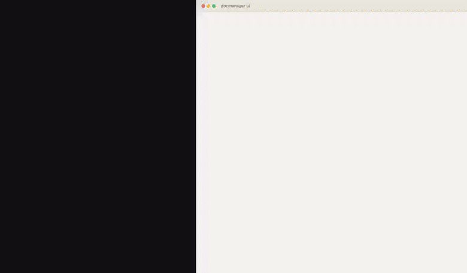

<h1 align="center">docmanager-axi</h1>
<p align="center">
  <a href="https://github.com/adeeshsharma/docmanager-axi/actions/workflows/ci.yml"
    ></a>
  <a href="https://www.npmjs.com/package/docmanager-axi"
    ></a>
  <a href="https://img.shields.io/badge/platform-macOS%20%7C%20Linux%20%7C%20Windows-blue?style=flat-square"
    ></a>
  <a href="./LICENSE"
    ></a>
</p>

<h3 align="center">Git for HTML documents - tracked, versioned, and synced by your coding agent.</h3>

<p align="center">
  
</p>
<p align="center"><a href="media/demo.mp4">Full-length video (media/demo.mp4)</a></p>

Every "which version of this HTML is actually current" question turns into hunting through a downloads folder full of `report-final-v2-ACTUAL.html`. **docmanager-axi** tracks HTML documents the way git tracks code: point it at a file once, and every real edit becomes a new version automatically - no commit step, no confirmation, nothing to remember. It runs entirely on your own machine.

- **Agent-first** - the whole surface is a CLI your coding agent drives directly: TOON output, structured errors with real exit codes, idempotent commands. A local web UI exists too, for you to read documents and browse history by hand, but the CLI is the primary interface.
- **Local-first** - no server, no account, no cloud component of any kind, unless you deliberately point it at a git remote you control for cross-machine sync.
- **Automatic, not automated-guessing** - a change to a file you already told it to track becomes a new version with no confirmation needed, since there's nothing ambiguous about it. A newly noticed file that merely *resembles* an existing one is only ever suggested, never auto-linked - that connection is always your call.
- **Real history, not a snapshot** - every version is content-addressed and kept, diffable and revertible, synced across machines through a git remote you already trust.

docmanager-axi is an [AXI](https://axi.md), which means -

- It's just a CLI any capable agent can run once installed - no special SDK needed on the agent's side.
- It's optimized for agent ergonomics: TOON output, structured errors with real exit codes (`0` success, `1` error, `2` usage error), idempotent mutations (tracking an already-tracked file is a no-op, not an error), and it fails loud on an unrecognized flag instead of silently ignoring it.
- The Agent Skill and the session-start hook are how an agent actually learns the tool - the skill for on-demand loading in any agent that supports the format, the hook for ambient context at the start of every session so a fresh agent already knows what's tracked without being told.

## Quick Start

**Regardless of which install method you use below, always run this first:**

```sh
npx skills add adeeshsharma/docmanager-axi --skill docmanager
```

This installs the Agent Skill in the [Agent Skills](https://agentskills.io) format with [`npx skills`](https://github.com/vercel-labs/skills) - it teaches your agent the full command surface (`track`, `status`, `families`, `diff`, `revert`, `rename`, `tags`, `search`, `snapshot push`/`pull`, `setup ssh`) and the real invariants that matter: a change to an already-tracked file is captured automatically with no confirmation; a newly noticed file that merely resembles an existing one is only ever suggested, never auto-linked; and installing `git` or generating an SSH key are real changes to your machine that always need your own explicit, in-the-moment approval - never taken on the agent's own initiative. **Without this step, your agent is driving the raw CLI by hand with no guidance on what these commands actually guarantee.**

By default the skill lands in the current project's skills directory (`.claude/skills/`, for example); add `-g` to install it for all projects (`~/.claude/skills/`).

Then, once the CLI itself is installed (see below), install the session-start hook so a new agent session opens already knowing what's tracked:

```sh
docmanager setup hooks
```

Works for Claude Code, Codex, or OpenCode (whichever is present). The skill and the hook teach an agent the same thing; use whichever your setup supports, or both.

## Install the CLI

### From npm

```sh
npm install -g docmanager-axi
```

```sh
# or, without a global install:
npx docmanager-axi <command>
```

### From source (for development on docmanager-axi itself)

```sh
git clone git@github.com:adeeshsharma/docmanager-axi.git
cd docmanager-axi
npm install
npm link          # puts `docmanager` on PATH, backed by this checkout
```

`npm link` gives the same `docmanager <command>` experience the npm-installed version does, just pointed at your local checkout instead of the registry. Prefer not to touch global npm links? Run everything as `node bin/docmanager.js <command>` from inside the checkout instead - identical behavior.

## Prerequisites

- Node.js 22 or later (`better-sqlite3` and `lavish-axi` both require it).
- `git`, already installed and on `PATH`. The content store is a real git repository under the hood; this is not optional.

If `git` is missing, `docmanager` fails with a clear, structured error instead of a raw stack trace. If an agent is setting this up on a user's behalf, it should say `git` is missing and ask before running any install command - never install it silently. This exact rule is baked into the Agent Skill above.

## How It Works

```
┌────────────────────────────┐
│ docmanager track <path>    │
│ hashes the content, creates│
│ a family + its first       │
│ version                    │
└──────────────┬─────────────┘
               ▼
┌────────────────────────────┐
│ Edit the file, save it. The│
│ next read (a status check, │
│ opening the UI) captures a │
│ new version automatically -│
│ no confirmation needed     │
└──────────────┬─────────────┘
               ▼
┌────────────────────────────┐
│ docmanager ui - read any   │
│ version, diff two of them, │
│ revert, rename, tag        │
└──────────────┬─────────────┘
               ▼
┌────────────────────────────┐
│ docmanager snapshot push - │
│ full history to a git      │
│ remote you control; pull it│
│ down on another machine    │
└────────────────────────────┘
```

- **Tracking** - `docmanager track <path>... [--as <name>] [--relink]` starts tracking one or more files and/or whole folders in one call. A folder is expanded recursively for `.html` files, skipping vendor/build directories (`node_modules`, `.git`, `dist`, and similar) by default, so pointing it at a folder that happens to contain other projects only ever picks up documents that actually belong to the user. One target failing never aborts the rest of a batch.
- **Automatic version capture** - a change to an already-tracked file becomes a new version the next time anything reads state (`docmanager status`, opening the UI). No live filesystem watcher in this version - reconciliation is triggered by a read, not continuous.
- **Never guesses a link** - `docmanager families`/`status` may flag a `possibleDuplicates` entry when two separately-tracked documents share a normalized title or near-identical structure. It's a cheap heuristic nudge, never acted on automatically - review it and run `docmanager link <fromId> <toId>` yourself if it really is the same document.
- **Diff, revert, delete a version** - `docmanager families diff <id> <hashA> <hashB>` (a line diff on normalized content, so whitespace-only differences never show up as fake changes), `docmanager families revert <id> <hash>` (moves the current version back; never edits the real file on disk), `docmanager families delete-version <id> <hash>` (permanently discards one version's record, healing the history around it - refuses on a document's only remaining version, and refuses if a live locally-mapped file still holds that exact content, since the next reconcile would just bring it right back).
- **Rename and tag** - `docmanager families rename <id> <newPath>` changes a document's synthetic path without losing any history. `docmanager families tags <id> [--set/--add/--remove]` attaches free-form labels, indexed for search too.
- **Folders** - organize tracked documents into a nested folder hierarchy, independent of their synthetic path: `docmanager folders create/list/rename/move/delete` manage folders (a folder can exist empty; delete refuses unless it's already empty), and `docmanager families move <id>... --to-folder <folderId>` (or `--unfile`) moves one or more documents. The UI's sidebar renders this as a real, expandable tree, with an explicit "Move to folder" action on each document and for bulk selections.
- **Cross-document links** - not to be confused with `docmanager link` above (that declares one document *is a newer version of* another; this is about literal `<a href>` navigation between separately tracked documents). Tracking a document also tracks whatever other HTML documents it links to, following the whole reachable cluster within the folder it was tracked from - a link between two tracked documents actually opens the target inside the reading pane, resolved to whichever version is current *right now*, not whatever was current when the link was captured. A link added later (an edit, picked up on the next reconcile) works the same way, no extra step needed. Clicking a link inside the reading pane opens that document properly - its own title, tags, and version timeline, not just a swapped iframe - with a Back button to return to wherever you came from.
- **Per-version highlights** - select text in the reading pane and mark it in one of four colors, directly, no command needed. A highlight belongs to the exact version it was made on: switch to a newer version of the same document and it's gone, by design - re-highlight there if you want it to carry forward. Hover an existing highlight to remove it. Highlights sync as part of the document's own version history, the same as everything else docmanager tracks.
- **Edit a version with Lavish Editor** - the UI's "Edit in Lavish" button copies a ready-to-paste message for your agent, naming the exact version you're looking at. docmanager doesn't run the editing session itself (it has no agent loop of its own) - the agent does: `docmanager families lavish <id> <hash>` exports that version to a docmanager-owned working file and opens it in Lavish Editor in one step, using docmanager's own bundled `lavish-axi` dependency directly (never `npx`, never a global install), then `docmanager track <path> --as <name> --relink` + `docmanager status` capture the result as the next version once the review session ends - nothing is logged before that.
- **Keyword search** - `docmanager search <query>` finds a tracked document by the words actually in its path, title, or text (including tags). Not semantic search - it won't find a document by meaning alone.
- **Cross-machine sync** - `docmanager settings set --snapshot-remote <git-url>` then `docmanager snapshot push`/`pull`. A pull on a brand-new machine reconstructs the full document and version history immediately; the one manual step is reconnecting a synthetic path to a live file with `track --as <path> --relink`, since the tool never guesses that a file on a new machine is the same as one from a snapshot. `docmanager sync` (preferred over plain `pull` whenever more than one machine may be involved) additionally auto-resolves the two most common divergence shapes on its own - the same document edited on two machines, and two machines that independently tracked the same document before ever syncing - falling back to the same clean, zero-data-loss conflict abort as `pull` for anything less mechanical (`--dry-run` to preview, `--no-auto-link` to report a path collision without linking it). The remote's own privacy is entirely your responsibility - docmanager adds no access control on top of it - so the very first push refuses until you run `docmanager snapshot push --acknowledge-privacy`; a one-time confirmation, never asked again after.
- **Fresh-machine auth** - an HTTPS remote can use an access token (`docmanager settings set --snapshot-remote-token <token>`, local-only, never part of a snapshot); an SSH remote uses this machine's own key, checked read-only with `docmanager setup ssh` (never generates a key on its own - the same approval-gating rule as installing `git`).
- **The background service** - the first `docmanager` command starts a small background process automatically; it stops itself after a long period of no activity, or immediately with `docmanager core stop`. After an upgrade, it also detects that it's running older code than what's actually installed and restarts itself transparently the next time it's needed.
- **`docmanager doctor`** - checks git/store/index/local-state health, auto-repairing what's provably safe and reporting the rest for a human to decide.
- **`docmanager reset --confirm`** - the safe, supported way to delete everything and start fresh, instead of manually removing `~/.docmanager`. Irreversible, refuses without `--confirm`, and an agent must never run it on its own initiative - the same rule as installing `git` or generating an SSH key.
- **`docmanager gc`** - runs `git gc` on the local store to compact its history and reclaim disk space, since every version of every tracked document is a git commit forever. Non-destructive (document data is untouched) and opt-in - never run automatically.

## CLI Reference

| Command | Does |
|---|---|
| `docmanager` | Show current state: core status, tracked document count |
| `docmanager track <path>... [--as <name>] [--relink]` | Start tracking one or more files and/or folders |
| `docmanager untrack <id>...` | Stop tracking one or more documents (does not delete the real files) |
| `docmanager link <fromId> <toId>` | Declare that `toId` supersedes `fromId` |
| `docmanager families` | List tracked documents |
| `docmanager families view <id>` | One document's full version history |
| `docmanager families diff <id> <hashA> <hashB>` | Show what changed between two versions |
| `docmanager families revert <id> <hash>` | Make an older version current again (history only, real file untouched) |
| `docmanager families delete-version <id> <hash>` | Permanently discard one version's record |
| `docmanager families export <id> <hash> --to <path>` | Write one version's raw content to a file |
| `docmanager families lavish <id> <hash>` | Export a version and open it in Lavish Editor, in one step |
| `docmanager families rename <id> <newSyntheticPath>` | Change a document's synthetic path, keeping its full history |
| `docmanager families tags <id> [--set "a,b"] [--add <tag>] [--remove <tag>]` | View or change a document's tags |
| `docmanager families move <id>... --to-folder <folderId>` / `--unfile` | Move one or more documents into a folder, or back out to unfiled |
| `docmanager folders create <name> [--parent <id>]` | Create a folder, optionally nested under another |
| `docmanager folders list` | Show the folder tree |
| `docmanager folders rename <id> <newName>` | Rename a folder in place |
| `docmanager folders move <id> [--parent <id>]` | Move a folder under a different parent (or root) |
| `docmanager folders delete <id>` | Delete an empty folder (refuses if it still has anything inside) |
| `docmanager search <query>` | Keyword search over tracked documents' paths, titles, tags, and text |
| `docmanager status` | Reconcile and show current tracked state |
| `docmanager settings get` / `set --snapshot-remote <url>` / `set --snapshot-remote-token <token>` | Read or write settings |
| `docmanager snapshot push [--acknowledge-privacy]` / `pull` | Sync the store with the configured remote (first push ever needs the flag once) |
| `docmanager sync [--dry-run] [--no-auto-link]` | Pull and auto-resolve the two common divergence shapes instead of always stopping at a raw git conflict - prefer this over `snapshot pull` whenever more than one machine may be involved |
| `docmanager ui` | Open the local web UI |
| `docmanager setup hooks` | Install agent session-start integration |
| `docmanager setup ssh` | Read-only SSH auth check for the configured remote - never generates a key |
| `docmanager core start` / `status` / `stop` | Manage the background service directly |
| `docmanager doctor` | Check git/store/index/local-state health |
| `docmanager reset --confirm` | Permanently delete everything and start fresh (irreversible) |
| `docmanager gc` | Compact store history and reclaim disk space (non-destructive, opt-in) |
| `docmanager update [--check]` | Self-update (built in, no per-tool code) |

Every command's full flag reference is available via `--help`, e.g. `docmanager track --help`.

## Development

```sh
npm install
npm run build     # copies src/ui into dist/ui; server.js serves dist/ui when present, src/ui otherwise
npm test          # node's built-in test runner
node bin/docmanager.js --help
```

No bundler, no framework for the CLI, core, or UI - all plain Node/HTML/CSS/JS, to keep the published package small. `npm test` uses `DOCMANAGER_HOME`/`DOCMANAGER_PORT` overrides internally to fully isolate itself from any real, already-running core on the same machine - safe to run alongside normal use. CI runs the same suite, `npm run build:skill:check` (fails if the committed Agent Skill has drifted from its source), `npm run build`, and `npm pack --dry-run` on macOS, Windows, and Ubuntu.

See [CHANGELOG.md](./CHANGELOG.md) for what's changed, [RELEASING.md](./RELEASING.md) for the release checklist, and [CONTRIBUTING.md](./CONTRIBUTING.md) for this project's current contribution policy.

## License

MIT © [Adeesh Sharma](https://github.com/adeeshsharma) - see [LICENSE](./LICENSE).
